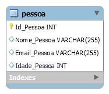
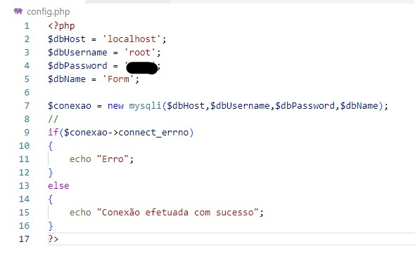
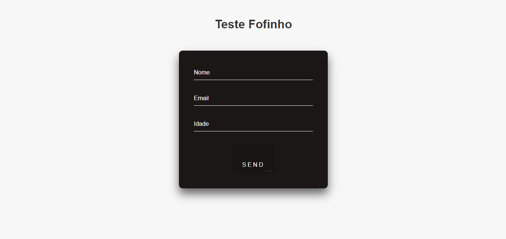
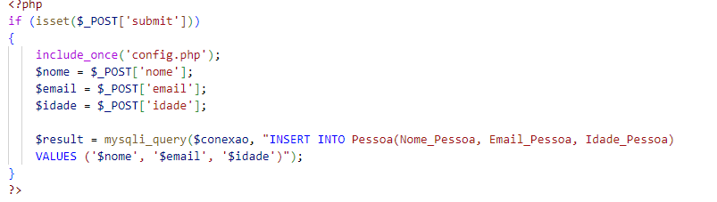

# Formulário Simples
### Desenvolvido por Lucas Moura
## Descrição:

O formulario, pega informações basicas e as passa para o banco de dados mysql, por meio de uma configuração php

## Linguagens Utilizadas:
### HTML, CSS, PHP 
## API's Utilizadas:
Visual Studio Code, MySQL, e Xampp

# Processos:

O primeiro passo foi desenvolver um banco de dados simplista que contesse as informações nescessarias.

O segundo passo, foi configurar o login do banco de dados com o codigo 

Depois, foi necessario criar um documento que abrangesse as 3 tecnologias usadas para criar a interface WEB

E por fim, realizar a conexão com o banco de dados por meio do submit

